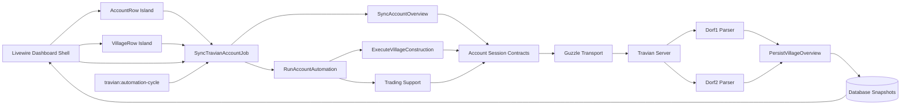
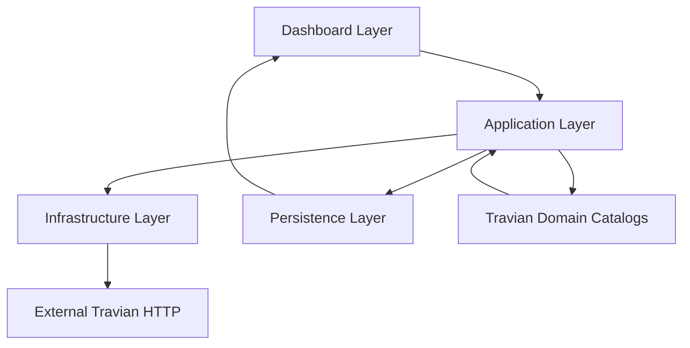
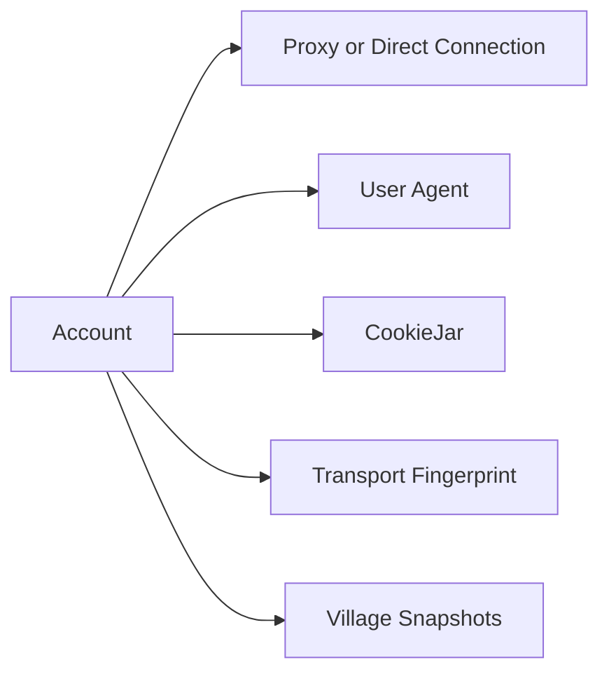
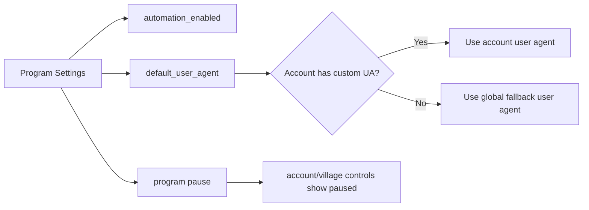
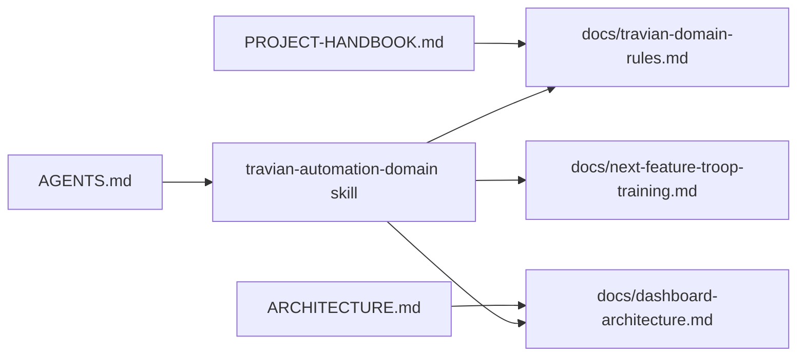

# Project Map

## Visual Flow

## Runtime Layers

## Isolation Map

## Settings Map

## Domain Docs Map

## Current Human Reading Summary

- `Dashboard` triggers sync, village updates, settings changes, and displays stored snapshots.
- `AccountRow` and `VillageRow` keep row-specific rendering and actions smaller than the old dashboard shell.
- `SyncTravianAccountJob` is the main queued entry point for both full-account and single-village work.
- `travian:automation-cycle` is a CLI shortcut that dispatches the same job.
- `Application` orchestrates login, download, parse, persist, and construction decisions.
- `Infrastructure` hides Guzzle and cookie mechanics.
- `Database` stores the latest account and village state.
- `Program settings` provide shared defaults without overriding per-account choices.
- `Dashboard live refresh` reads local Laravel state only and does not call Travian by itself.
- `TravianBuildingCatalog` owns building ids, final levels, requirements, and special layout rules.
